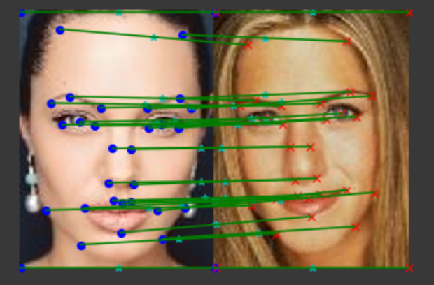
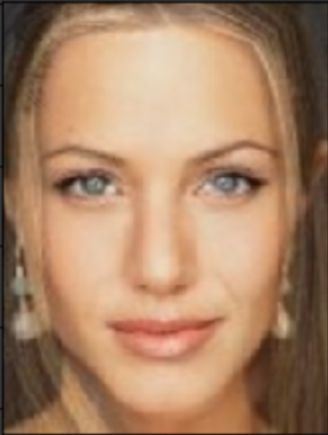

# ComputerVision
- [Yolo](#yolov1)  
- [Optical Flow](#optical-flow)
- [Homography & RANSAC](#homography-&-ransac)
- [Image Blending](#image-blending)
- [Image Morphing](#image-morphing)
- [Canny Edge Detection](#canny-edge-detection)

## YOLOv1

Used Delaunchy triangulation and Bycentric coordination to merge two images 

## Optical Flow

Used Delaunchy triangulation and Bycentric coordination to merge two images 

## Homography & RANSAC

Used Delaunchy triangulation and Bycentric coordination to merge two images 

## Image Blending

Used Delaunchy triangulation and Bycentric coordination to merge two images 

## Image Morphing

Used Delaunchy triangulation and Bycentric coordination to merge two images 

## Canny Edge Detection

Used Delaunchy triangulation and Bycentric coordination to merge two images 

## Technologies
python3.6
