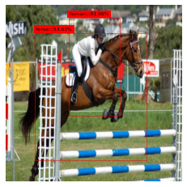
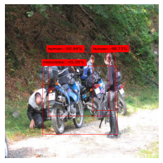

# You Only Look Once

## Usage
### local
use terminal to the directory and run the command below</br>
```bash
python3 ./train.py
```
### colab
run all cells

## Results
</br>
</br>

## System Requirements
GPU:at least 6 GB</br>
RAM:at least 16 GB</br>

## Reference
**paper(https://www.cv-foundation.org/openaccess/content_cvpr_2016/papers/Redmon_You_Only_Look_CVPR_2016_paper.pdf)
